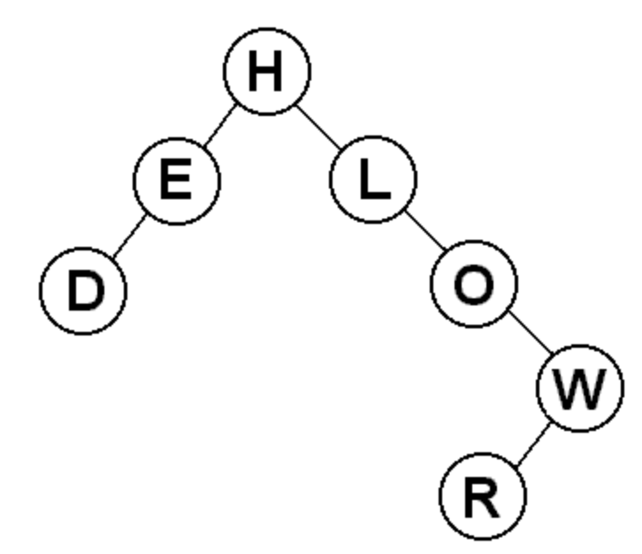
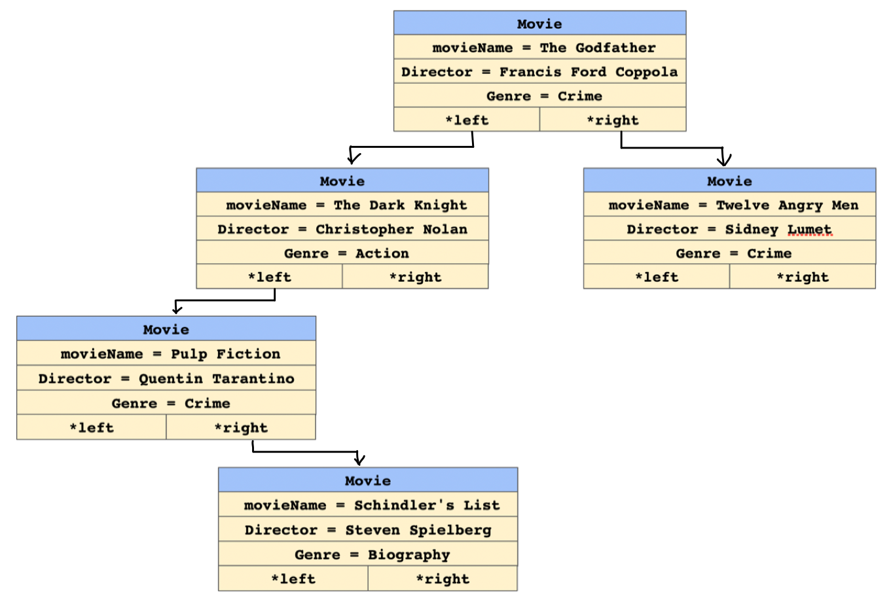
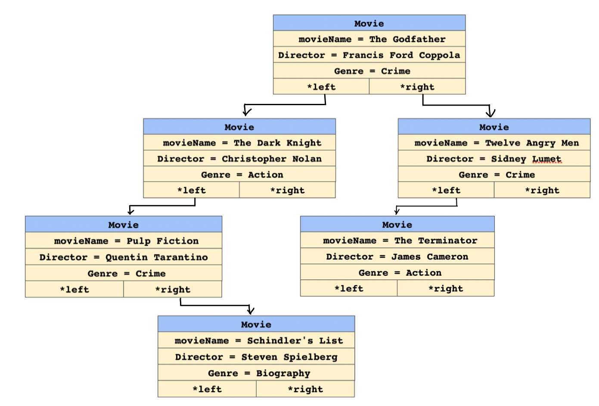
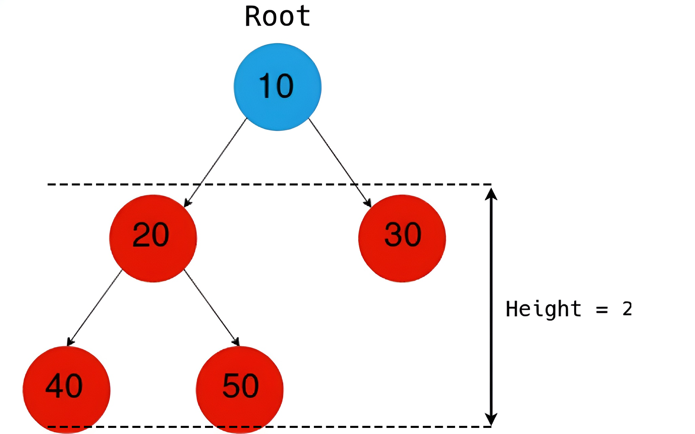

[](https://classroom.github.com/a/JadVsFI6)
# CSCI 2270 – Data Structures - Assignment 6 - Binary Search Tree

## Objectives

1. Build a binary search tree (BST)
2. Traverse, Search and Insert in a BST

## Instructions to run programs

Please read all the directions ​*before* writing code, as this write-up contains specific requirements for how the code should be written.

To receive credit for your code, you will need to pass the necessary test cases. Use the following steps to test your code as you work on the assignment:

 1. Open up your Linux terminal, navigate to the build directory of this assignment (e.g. `cd build`).
 2. Run the `cmake ..` command.
 3. Run the `make` command.
 4. If there are no compilation errors, two executables will be generated within the build directory: `run_app` and `run_tests`.
 4. If you would like to run your program, execute `run_app` from the terminal by typing `./run_app <Any Required Arguments>`.
 5. To run the grading tests, execute `run_tests` from the terminal by typing `./run_tests`.

## Background 

Binary Search Trees (BST) are very interesting data structures. Let's break down what they mean.

    1. Tree: A tree is a hierarchical data structure. Every node has zero or more children (where each child is also a node of the tree). It starts with a root node (start of the tree) and branches out to the leaf nodes(have no children).

    
    2. Binary: While a tree node can have any number of children, making it binary restricts the children to atmost 2. (So a node in a binary tree can have 0, 1 or 2 children only)


    3. Search: This is what makes a BST unique. BSTs have some rules in place which allow us to 'search' faster in our tree data structure. Let's look at these rules which must be honored by every node of a BST.
    (a) Each BST node must be associated with a key. This key could be an integer, string, float, etc.
    (b) For each node of the BST, ALL nodes in the left subtree must have key 'lesser' than the key of the node.
    (c) For each node of the BST, ALL nodes in the right subtree must have key 'greater' than the key of the node.
    (d) For this assignment, no two movies have the same `movieName`.

Based on this definition, the following is a letter BST example


 ## Overview
 
 In this assignment, you should store the information of some movies in a binary search tree. For each movie, we will store its name, author, and rating. A sample dataset from has been given in `movies.csv`. This is the definition of the `Movie` struct in `MovieCollection.hpp`:
```
 struct Movie {
    string movieName;
    string director;
    string genre;

    Movie* left = nullptr;
    Movie* right = nullptr;
};
```
The tree is such that all the children of a node on its left child's subtree have `movieName` alphabetically `smaller` than the parent node. Similarly, the children on the right subtree are alphabetically `larger`.

You can use the `movies.csv` file to test the functions, but you can run the program without it as well. If you want to use the dataset, simply add `../movies.csv` as an argument to `run_app`. You don't need to do this, and simply running it without any arguments will also work, but will start with an empty collection. 

Here are a few entries from the dataset:


| Name | Genre | Director
| --- | --- | --- |
The Godfather | Crime |	Francis Ford Coppola	|
The Dark Knight	| Action	| Christopher Nolan	|
Twelve Angry Men	|	Crime	|	Sidney Lumet	|
Pulp Fiction	|	Crime	|	Quentin Tarantino	|
Schindler's List	|	Biography	|	Steven Spielberg	|

If we add these items in the given order, the tree should be as follows: 

```Example 1```



**NOTE:** `app/main.cpp` file has been provided for you. Do NOT make any changes to the `app/main.cpp` file). For the described setting, you will have to implement the following #TODO functions in `code/MovieCollection.cpp`. 

### Constructor: MovieCollection()
Class constructor. Set the root of the tree to a `nullptr`.

### Destructor: ~MovieCollection()
Class destructor. Free all memory that was allocated and set root to `nullptr`. 

For any movies present in the collection, you need to recursively delete both the children and only then delete the current movie. If you delete the current movie first, `movie->left` and `movie->right` will become inaccessible.

### void addMovie(string movieName, string genre, string director)

Add a new movie to the collection based on the `movieName`. You should create a new `movie`, initialize it with the given information (movieName, genre and director), and add it to the tree. Your tree should still be a valid Binary Search Tree after the insertion. 

*Hint: you can compare strings with `<`, `>`, `==`, `string::compare()` function.*

**NOTE:** No two movies have the same `movieName`.

<h4 id="example-godfather">
  <code>Example:</code>
</h4>

If in the ```Example 1``` we add a new movie by calling the addMovie function as follows:


```
addMovie("The Terminator", "Action", "James Cameron");
```

The updated BST should look like:

```Example 2```




### showMovieCollection() 

Show all the movies added to the collection so far, in alphabetical order. You can use the following line of code to print all the information:

```
cout << "MOVIE: " << movie->movieName << " GENRE: " << movie->genre << " DIRECTED BY: " << movie->director << endl;
```

For ```Example 2``` above, you should print: 

```
MOVIE: Pulp Fiction GENRE: Crime DIRECTED BY: Quentin Tarantino
MOVIE: Schindler's List GENRE: Biography DIRECTED BY: Steven Spielberg
MOVIE: The Dark Knight GENRE: Action DIRECTED BY: Christopher Nolan
MOVIE: The Godfather GENRE: Crime DIRECTED BY: Francis Ford Coppola
MOVIE: The Terminator GENRE: Action DIRECTED BY: James Cameron
MOVIE: Twelve Angry Men GENRE: Crime DIRECTED BY: Sidney Lumet

```

If the collection is empty, print `cout << "Collection is empty." << endl;`

*Hint: to traverse the tree using preorder , for every node you need to first print the root, then all its descendents in the left subtree, and then every descendent in the right subtree.*


### void showMovie(string movieName)

In the `movieCollection`, search for a `movieName` matching the given `movieName`. If the movie is found, display its properties:

```
cout << "Movie:" << endl;
cout << "==================" << endl;
cout << "Name :" << movie->movieName << endl;
cout << "Genre :" << movie->author << endl;
cout << "Director :" << movie->rating << endl;
```
If the movie is not found in the collection, print `cout << "Movie not found." << endl;`

*Hint: You should utilize the properties of a Binary Search Tree, so that the search time is limited to O(log n). Starting from the root, at every node, if it doesn't match the given title, you shoud either choose to traverse the left subtree or the right subtree.*

#### ```Example:```

If in the ```Example 2``` we search using the following command: 


```
showMovie("Pulp Fiction");
```

You should output:
```
Movie:
==================
Name :Pulp Fiction
Genre :Crime
Director :Quentin Tarantino
```

If you search for:

```
showMovie("Deadpool2");
```

You should output:

```
Movie not found.
```


### void showMoviesByDirector(string director)
The objective of this method is to print the `movieName` (and `genre`) for ALL the movies by a particular director in reverse alphabetical order (use a reverse-order traversal). 

The first line to be printed from this method is the director we are searching for as given in the function parameter. You print this irrespective of the fact you find the movives

```
cout << "Movies Directed By: " << movie->director << endl;
```

If the director of a movie matches the director we are searching for, you print the following:

```
cout << " MOVIE: " << movie->movieName << " GENRE: " << movie->genre << endl;

```


#### ```Example:```

If in the ```Example 2``` we want to search for movies directed by Christopher Nolan using the following command: 


```
showMoviesByDirector("Christopher Nolan");
```

You should output:

```
Movies directed by: Christopher Nolan
MOVIE: The Dark Knight GENRE: Action
```

If you search for a director (like Alfred Hitchcock) whose movies do not exist in the collection, just display the first line and dont print anything like as follows:

```
Movies directed by: Alfred Hitchcock
```

### void printleaves()
The objective of this method is to print all the leaf nodes of the given binary tree from left to right in the following format.
```
cout << "MOVIE: " << movie->movieName << " DIRECTOR: " << movie->director << " GENRE: " << movie->genre << endl;
```
In the above example 2, the results should be look like:
```
MOVIE: Schindler's List GENRE: Biography DIRECTED BY: Steven Spielberg
MOVIE: The Terminator GENRE: Action DIRECTED BY: James Cameron
```

### int getHeightOfMovieCollection()

Your goal is to write a function that finds the height of a tree. __If the tree is empty, you must return an error code defined by__ <code>EMPTY_TREE_ERROR</code> like so:
<code>return EMPTY_TREE_ERROR;</code>

The height of a tree is the length of the longest possible path from the tree's root down to its furthest leaf. The easiest way to think about height is to count the number of nodes in the longest possible path, __excluding the root__.

For a given node N, the height of N is the longest possible path from N down to its furthest leaf, __excluding N__.

In the example above, the height of [The Godfather](#example-godfather) - as well as that of the tree - is 3.

The height of the tree would also be an upper bound for the number of comparisons we might need to search for an item. 

#### ```Example:```

If in the [Example 2](#example-godfather) we want to find the height of the collection, we call the following function: 

```
getHeightOfMovieCollection();
```

Which should return:

```
3
```

To understand how the height is calculated, you may use the following image:

NOTE: The tree is not a BST, but the height calculation is done in the same way.


### Submitting your code:
Write your code and push the changes to your private repository. Log onto Canvas and go to Assignment 6. Paste your GitHub repository link and submit.

### Appendix
You will have to traverse through the collection by calling a helper function. For example, if you want to reach the leaf nodes of the trees you will implement it in the following way:

```
void MovieCollection::leafNode()
{
    leafNodeHelperFunction(root);
}

void leafNodeHelperFunction(Movie* currNode)
{
    if(currNode!=nullptr)
    {
        if(currNode->left == nullptr && currNode->right == nullptr)
        {
            //reached the leaf node - now you can print whatever you want and do whatever
            cout << currNode->movieName << endl; // leaf node movie
            return;
        }
        // These two lines will recursively call the left and right sub-tree respectively. 
        // You can go to the bottom of the tree by calling the same function on the current nodes left and right children
        leafNodeHelperFunction(currNode->left);
        leafNodeHelperFunction(currNode->right);
    }
}
```
